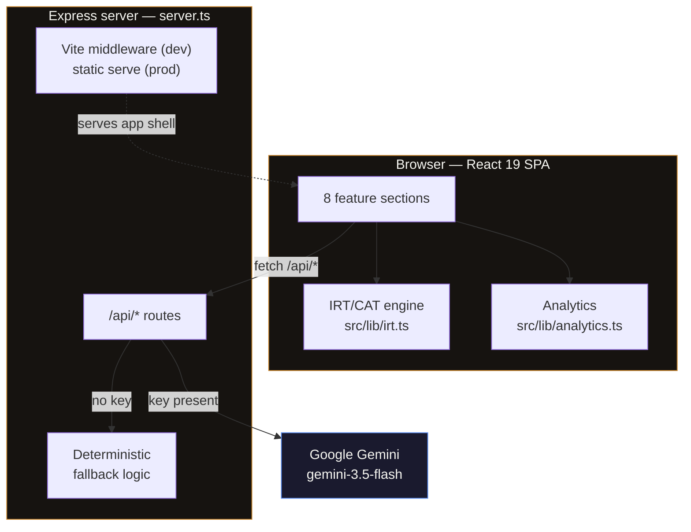

<div align="center">

# CalculixHub

**An AI-native operating system for mathematical thinking.**

Adaptive assessment built on real psychometrics, competition training, and learning analytics — for students training toward AMC, AIME, USAMO and IMO.

[](https://github.com/gmtigrisva123/CalculixHub/actions/workflows/quality.yml)
[](https://github.com/gmtigrisva123/CalculixHub/actions/workflows/check.yml)
[](https://github.com/gmtigrisva123/CalculixHub/actions/workflows/deploy-pages.yml)
[](LICENSE)
[](.nvmrc)

[Live demo](https://gmtigrisva123.github.io/CalculixHub/) · [Adaptive engine](#the-adaptive-engine) · [API](#api-reference) · [Getting started](#getting-started) · [Contributing](#contributing)

</div>

---

## Table of contents

- [What this is](#what-this-is)
- [Project status and what is simulated](#project-status-and-what-is-simulated)
- [Feature tour](#feature-tour)
- [The adaptive engine](#the-adaptive-engine)
- [The analytics layer](#the-analytics-layer)
- [The AI layer](#the-ai-layer)
- [Architecture](#architecture)
- [API reference](#api-reference)
- [Tech stack](#tech-stack)
- [Getting started](#getting-started)
- [Scripts](#scripts)
- [Project structure](#project-structure)
- [Deployment](#deployment)
- [Continuous integration](#continuous-integration)
- [Contributing](#contributing)
- [Roadmap](#roadmap)
- [License](#license)

---

## What this is

Most "adaptive learning" products adapt by heuristic: get one right, get a harder one. CalculixHub instead implements the estimator that actual standardized adaptive tests use — a **three-parameter logistic (3PL) Item Response Theory model** with Expected A Posteriori ability estimation and Maximum Fisher Information item selection.

The practical difference is that the platform reports a *calibrated* ability estimate with a standard error attached, decides for itself when it has measured you precisely enough to stop, and can say "I don't have enough data to claim that yet" instead of inventing a flattering number.

Around that engine sits a full learning environment: a personalized path generator, error-pattern classification that distinguishes conceptual gaps from computational slips, competition simulation, a Socratic AI tutor, and a research view that exposes the psychometrics rather than hiding them.

- **Domains covered** — Algebra · Geometry · Combinatorics · Number Theory
- **Tiers** — Foundation · Advanced · Olympiad
- **Item sources** — AMC 8 · AMC 10 · AIME · USAMO · IMO

---

## Project status and what is simulated

This is a **working technology demonstrator**, not a production service with real users. The engineering is real; some of the data around it is illustrative. Stated plainly so you are not surprised by anything you find in the source:

| Area | Status | Detail |
|---|---|---|
| IRT / CAT engine | **Real** | Fully implemented 3PL model, EAP estimation, Fisher-information selection — [`src/lib/irt.ts`](src/lib/irt.ts) |
| Analytics layer | **Real** | Forecasting, error classification, learning-path generation — [`src/lib/analytics.ts`](src/lib/analytics.ts) |
| AI tutor & feedback | **Real**, needs a key | Google Gemini via a server-side proxy; falls back to deterministic logic without a key |
| Item bank | **Real but small** | 37 calibrated items ([composition below](#item-bank-composition)) — enough to exercise the engine, not a full curriculum |
| Landing-page "live" counters | **Simulated** | `activeUsers: 1428`, `testsCompleted: 12482` are hardcoded literals in [`WelcomeScreen.tsx`](src/components/WelcomeScreen.tsx). They are presentational placeholders, not telemetry. |
| Leaderboard, contests, discussions | **Seeded fixtures** | Served from `GET /api/statistics-seed` |
| Authentication | **Front-end mock** | Validated against an in-memory user list, session held in `sessionStorage`. No backend verification, no password hashing, no accounts. **Do not treat as a security boundary.** |
| Persistence | **None** | All learner state lives in memory and resets on reload. There is no database. |

The `GET /api/live-stats` counters do start at zero server-side and increment on real activity events; the landing page simply does not read from them.

If you are evaluating this repository, [`src/lib/irt.ts`](src/lib/irt.ts) and [`src/lib/analytics.ts`](src/lib/analytics.ts) are where the substance is.

---

## Feature tour

The application is a single-page app with eight sections:

| Section | What it does |
|---|---|
| **Dashboard** | Skill radar across the four domains, streak tracking, AI-recommended next action, live activity feed |
| **Learn** | Adaptive practice with LaTeX rendering, progressive hints, and AI-evaluated free-text answers |
| **Compete** | Timed contest simulation, weekly challenges, and a multi-axis leaderboard (speed / accuracy / consistency / improvement) |
| **Progress** | Mastery trajectory, velocity charting, and a forecast with an explicit confidence level |
| **Community** | Threaded per-problem discussion with Student / Mentor / Admin roles |
| **Profile** | Achievements, tier standing, and percentile against the reference population |
| **Research** | The psychometrics made visible — θ estimate, SEM, reliability, test information, item-level parameters |
| **Settings** | Preferences and session control |

Mathematical notation is rendered with KaTeX throughout ([`MathText.tsx`](src/components/MathText.tsx)).

---

## The adaptive engine

Implemented in [`src/lib/irt.ts`](src/lib/irt.ts). This is the core of the project, so it is worth describing precisely.

### Response model

Each item carries three calibrated parameters — discrimination `a`, difficulty `b`, and pseudo-guessing `c`. The probability that a learner of latent ability `θ` answers correctly is:

$$P(\theta) = c + (1 - c)\cdot\frac{1}{1 + e^{-1.7a(\theta - b)}}$$

The `1.7` is the standard logistic-to-normal-ogive scaling constant. The `c` asymptote matters for multiple choice: a learner with very low ability still has roughly a `1/n` chance of guessing correctly, and a model that ignores that systematically overestimates ability.

### Ability estimation — EAP, not MLE

Ability is estimated by **Expected A Posteriori**: a standard normal prior `N(0,1)` is multiplied by the likelihood of the observed response pattern across an 81-point quadrature grid spanning `θ ∈ [-4, 4]`. The posterior mean is the estimate; the posterior standard deviation is the standard error of measurement (SEM).

This is a deliberate choice over maximum likelihood. **MLE diverges to ±∞ on all-correct or all-wrong response patterns** — exactly the patterns that occur in the first few items of every test. EAP is stable from the very first response.

### Item selection — Maximum Fisher Information

The next item is the one that would most reduce uncertainty at the current estimate, using Fisher information:

$$I(\theta) = (1.7a)^2 \cdot \frac{1-P}{P} \cdot \left(\frac{P-c}{1-c}\right)^2$$

Pure information-greedy selection has a known failure mode: it drills into whichever single domain happens to be most discriminating and produces a skill profile with holes. So selection is **content-balanced** — the least-tested domains are prioritized, and information maximization operates within that pool.

### Stopping rule

The test is variable-length rather than fixed:

| Constant | Value | Meaning |
|---|---|---|
| `MIN_ITEMS` | 8 | Floor before the SEM rule can trigger |
| `MAX_ITEMS` | 16 | Hard cap |
| `TARGET_SEM` | 0.32 | Stop once the estimate is this precise (≈ 0.90 reliability) |

Reliability is reported as `1 - SEM²`, analogous to Cronbach's alpha.

### Score reporting

| Output | Derivation |
|---|---|
| Tier | Olympiad `θ ≥ 1.2` · Advanced `θ ≥ -0.4` · Foundation below |
| Recommended source | IMO `θ ≥ 2.0` · USAMO `≥ 1.2` · AIME `≥ 0.4` · AMC 10 `≥ -0.8` · AMC 8 below |
| Mastery % | `θ` linearly mapped from `[-3, 3]` onto `[0, 100]` |
| Percentile | Normal CDF via the Abramowitz & Stegun approximation, clamped to `[1, 99]` |

Per-domain ability is estimated by re-running EAP over the subset of responses in that domain, which is what seeds the skill radar.

### Item bank composition

37 calibrated items in [`src/lib/itemBank.ts`](src/lib/itemBank.ts):

| Domain | Items | Source | Items |
|---|---:|---|---:|
| Algebra | 10 | AMC 10 | 9 |
| Geometry | 9 | AMC 8 | 8 |
| Combinatorics | 9 | AIME | 8 |
| Number Theory | 9 | USAMO | 6 |
| — | — | IMO | 6 |

Each item also carries a `concept` tag used for weak-point isolation and remediation routing.

---

## The analytics layer

[`src/lib/analytics.ts`](src/lib/analytics.ts). The design principle throughout is that **the absence of data is reported as absence, not as a flattering default.**

- **`forecastProgress`** — projects an improvement trajectory, with confidence scaled by how many days of real data exist. A two-point line is labelled low confidence rather than presented as fact.
- **`analyzeErrorPatterns`** — classifies weaknesses by crossing mastery against accuracy. Low mastery with low accuracy indicates a *conceptual* gap (the method is missing); low mastery with high accuracy indicates *computational* slips (the method is known, execution fails). These need different remediation.
- **`computeMetrics`** — derives the four ranking axes (speed, accuracy, consistency, improvement) from real activity, returning `0` when a dimension cannot yet be measured.
- **`buildLearningPath`** — generates a personalized path, weakest domains first, each at the tier matching demonstrated mastery in *that* domain.
- **`computeStreak`** ([`streak.ts`](src/lib/streak.ts)) — timezone-safe streak computation over date keys.

---

## The AI layer

Google Gemini (`gemini-3.5-flash`) is called **exclusively server-side** in [`server.ts`](server.ts). The API key never reaches the browser; the client only ever talks to this project's own endpoints.

Three AI-backed capabilities:

1. **Socratic tutoring** (`POST /api/chat`) — a system prompt constrains the model to guided questioning rather than answer-dispensing, with LaTeX notation permitted.
2. **Answer evaluation** (`POST /api/evaluate`) — exact-match checking first, then AI-generated explanation and next-step guidance.
3. **Task recommendation** (`POST /api/recommend`) — weakest-skill identification combined with tier targeting.

**Graceful degradation is a first-class path, not an error case.** `getAI()` returns `null` when `GEMINI_API_KEY` is unset or still holds the placeholder value, and every endpoint falls back to deterministic logic, tagging responses with `isFallback`. **The application is fully usable with no API key** — you lose generated prose, not functionality.

---

## Architecture



Two properties worth noting:

- **The measurement engine runs client-side.** Ability estimation is pure computation over the response history, so it needs no round trip and works offline. The server is only involved for AI generation and fixture data.
- **One process serves both roles.** In development, Express mounts Vite as middleware for HMR; in production it serves the built `dist/` and falls through to `index.html` for SPA routing. There is no separate dev-server/API-server split to keep in sync.

---

## API reference

All routes are served from the same origin as the app.

| Method | Endpoint | Purpose | AI |
|---|---|---|---|
| `GET` | `/api/problems` | Full problem set | — |
| `GET` | `/api/statistics-seed` | Leaderboard, weekly challenges, contests, discussions | — |
| `GET` | `/api/live-stats` | Activity counters | — |
| `POST` | `/api/live-stats/event` | Record `test-completed` \| `problem-solved` \| `user-joined` | — |
| `POST` | `/api/recommend` | Next-task recommendation from `{ points, completedCount, accuracy, skills }` | ✅ falls back |
| `POST` | `/api/evaluate` | Grade `{ problemId, userAnswer }`, return explanation + guidance | ✅ falls back |
| `POST` | `/api/chat` | Socratic tutor turn from `{ message, history }` | ✅ falls back |

Endpoints marked "falls back" return deterministic responses tagged `isFallback: true` when no Gemini key is configured.

---

## Tech stack

| Layer | Technology |
|---|---|
| UI | React 19.0.1, TypeScript 5.8 (type-check only via `noEmit`; `strict` is **not** enabled — see [Roadmap](#roadmap)) |
| Build | Vite 6.2 |
| Styling | Tailwind CSS 4.1 (via `@tailwindcss/vite`) |
| Server | Express 4.21, `tsx` in dev, esbuild bundle in prod |
| AI | `@google/genai` 2.x — `gemini-3.5-flash` |
| Math rendering | KaTeX 0.18 |
| Motion | `motion` 12 |
| Icons | `lucide-react` |
| Runtime | Node.js ≥20 <23, npm ≥10 |

---

## Getting started

### Prerequisites

- **Node.js ≥20 and <23** — the version is pinned in [`.nvmrc`](.nvmrc) and enforced by `engines` in [`package.json`](package.json)
- **npm ≥10**

```bash
nvm use
```

### Install

```bash
git clone https://github.com/gmtigrisva123/CalculixHub.git
```

```bash
cd CalculixHub && npm ci
```

Prefer `npm ci` over `npm install` — it installs exactly the locked dependency tree and will not silently drift your lockfile.

### Configure (optional)

The app runs without any configuration. To enable the AI features:

```bash
cp .env.example .env
```

| Variable | Required | Purpose |
|---|---|---|
| `GEMINI_API_KEY` | No | Enables the AI tutor, answer explanations and recommendations. Without it, every AI endpoint serves its deterministic fallback. |
| `APP_URL` | No | Public URL used for self-referential links |
| `PORT` | No | Server port — defaults to `8000` |

Get a key from [Google AI Studio](https://aistudio.google.com/apikey). `.env` is gitignored; never commit a real key.

### Run

```bash
npm run dev
```

```
◇ injected env (1) from .env
[Calculix Hub] Server running at http://localhost:8000
```

Open **http://localhost:8000**. Vite HMR is active — edits reload in place.

> Set `DISABLE_HMR=true` to disable file watching and HMR. This exists to prevent flicker when an AI coding agent is editing files rapidly; see [`vite.config.ts`](vite.config.ts).

### Production build

```bash
npm run build && npm start
```

`build` emits two artifacts: the static client bundle in `dist/`, and `dist/server.cjs` — the Express server bundled by esbuild.

---

## Scripts

| Script | Action |
|---|---|
| `npm run dev` | Express + Vite middleware with HMR on `:8000` |
| `npm run build` | `vite build` → `dist/`, then esbuild the server → `dist/server.cjs` |
| `npm start` | Run the built production server |
| `npm run lint` | `tsc --noEmit` — full type check |
| `npm run clean` | Remove build artifacts |

There is no test suite yet; see [Roadmap](#roadmap).

---

## Project structure

```
├── server.ts                  Express server, API routes, Gemini proxy, Vite/static wiring
├── index.html                 SPA entry point
├── vite.config.ts             Build config, path aliases, HMR toggle
├── tsconfig.json              Type-check scope
│
├── src/
│   ├── main.tsx               React root
│   ├── App.tsx                Shell, navigation, session state
│   ├── types.ts               Domain model
│   ├── index.css              Tailwind entry + design tokens
│   │
│   ├── lib/
│   │   ├── irt.ts             ★ 3PL IRT / CAT engine
│   │   ├── analytics.ts       ★ Forecasting, error classification, learning paths
│   │   ├── itemBank.ts        37 calibrated items
│   │   ├── streak.ts          Timezone-safe streak computation
│   │   └── topics.tsx         Domain metadata
│   │
│   └── components/
│       ├── WelcomeScreen.tsx  Landing page + sign-in
│       ├── Dashboard.tsx      Skill radar, streaks, recommendations
│       ├── Learn.tsx          Adaptive practice
│       ├── Compete.tsx        Contests, challenges, leaderboard
│       ├── ProgressView.tsx   Mastery trajectory
│       ├── Community.tsx      Discussion threads
│       ├── Profile.tsx        Achievements, percentile
│       ├── ResearchAnalytics.tsx  Psychometrics inspector
│       ├── AITutorChat.tsx    Socratic tutor UI
│       ├── MathText.tsx       KaTeX rendering
│       └── charts/            Radar + velocity charts
│
├── calculix_realtime_patch/   Staged, NOT wired in — see Roadmap
└── .github/workflows/         CI
```

---

## Deployment

The app deploys to three targets, each with different capabilities:

| Target | Serves | API routes | Notes |
|---|---|---|---|
| **Vercel** | Full app | ✅ | Primary |
| **Cloudflare Workers** | Full app | ✅ | Secondary |
| **GitHub Pages** | Client only | ❌ | Static host — see below |

### The GitHub Pages caveat

[`deploy-pages.yml`](.github/workflows/deploy-pages.yml) builds the client bundle and publishes it to <https://gmtigrisva123.github.io/CalculixHub/> on every push to `main`.

**GitHub Pages is a static host, so it cannot run `server.ts`.** Consequently the AI tutor — which calls `/api/chat` — does not work there, and neither do the other `/api/*` routes. Everything that runs client-side does work: the full IRT engine, adaptive practice, analytics, charts and navigation.

Because Pages serves a project site from a subpath, the workflow derives Vite's asset base from `configure-pages`' `base_path` output rather than hardcoding the repository name — so a fork or rename needs no edit.

For the complete application, use the Vercel or Cloudflare deployment.

---

## Continuous integration

| Workflow | Trigger | Does |
|---|---|---|
| [`check.yml`](.github/workflows/check.yml) — *Lint* | push / PR to `main` | `tsc --noEmit` |
| [`quality.yml`](.github/workflows/quality.yml) — *Build* | push / PR to `main` | Full production build |
| [`deploy-pages.yml`](.github/workflows/deploy-pages.yml) | push to `main` | Build + publish to Pages |
| [`audit.yml`](.github/workflows/audit.yml) | manual | `npm audit` at high severity |

Dependency updates are automated via [Dependabot](.github/dependabot.yml).

The remaining workflows in `.github/workflows/` (`cleanup`, `format`, `metrics`, `notify`, `release`, `rollback`, `sync`, `test`) are `workflow_dispatch` placeholders that currently only echo a message. They are scaffolding, not active pipeline stages.

`calculix_realtime_patch/` is excluded from type checking, because it imports a dependency that is not installed. See [Roadmap](#roadmap).

---

## Contributing

Contributions are welcome. The conventions below are what the project already follows.

### Workflow

1. Branch from `main` — never commit to it directly.
2. Make your change, then verify locally **before** pushing:

   ```bash
   npm run lint && npm run build
   ```

3. Open a pull request against `main` using the [PR template](.github/PULL_REQUEST_TEMPLATE.md).
4. `Lint` and `Build` must pass. **Read the CI result rather than trusting a local pass** — a populated local `node_modules` can hide install-order bugs that only surface on a clean runner.

### Commit and merge conventions

- **One file per commit** where the change permits it. Keeps review and bisection precise.
- **Conventional Commits** — `fix(ci):`, `feat(learn):`, `docs:`, `refactor(irt):`.
- **Explain the *why*.** A commit body should state the root cause, what changed, and how it was verified — not restate the diff.
- **`main` requires linear history.** Merge by **squash or rebase**; merge commits are rejected.

### Where to start

| Area | Good first contributions |
|---|---|
| Item bank | Expand beyond 37 items; every item needs calibrated `a`, `b`, `c`, a `concept` tag and a hint |
| Testing | No test suite exists. `irt.ts` and `analytics.ts` are pure functions — ideal first targets |
| Accessibility | Keyboard navigation and screen-reader labelling audit |
| Persistence | See Roadmap |

When touching [`irt.ts`](src/lib/irt.ts), please state the psychometric reasoning in your PR. The parameter choices there are deliberate and load-bearing.

---

## Roadmap

**Testing.** The highest-value gap. `irt.ts` and `analytics.ts` are pure and deterministic — a property-based suite asserting that EAP stays bounded on degenerate response patterns, and that Fisher information peaks near `θ ≈ b`, would lock in the engine's correctness cheaply.

**Persistence and realtime.** [`calculix_realtime_patch/`](calculix_realtime_patch/) contains a staged Supabase integration — auth middleware, a realtime progress hook, event tracking, a live dashboard, and SQL migrations. **It is not wired in.** Activating it requires installing `@supabase/supabase-js`, adding `vite/client` types, following the instructions in `calculix_realtime_patch/server/README_IMPORT_IN_SERVER_TS.md`, and removing the directory from `exclude` in `tsconfig.json`. Until then it is excluded from type checking and ships dormant.

**Real authentication.** The current sign-in is a front-end mock and must be replaced before any deployment handling real learner data.

**Item bank scale.** 37 items exercises the engine; a production CAT wants hundreds so that content balancing and exposure control have room to operate.

**TypeScript `strict` mode.** [`tsconfig.json`](tsconfig.json) does not set `strict`, so `noImplicitAny` and `strictNullChecks` are both off — the type check currently passes over code it would otherwise reject. Enabling it incrementally (`strictNullChecks` first) would materially raise the safety floor, and matters most in [`irt.ts`](src/lib/irt.ts) where `estimateDomainAbility` legitimately returns `null`.

**Larger client bundle.** The main chunk exceeds 500 kB minified. Route-level code splitting via dynamic `import()` is the obvious remedy.

---

## License

Released under the **MIT License** — see [LICENSE](LICENSE). © 2026 The-Calculix.

> **Note on file headers:** some source files still carry an `SPDX-License-Identifier: Apache-2.0` comment inherited from the original AI Studio scaffold. These headers are stale and are being reconciled; **the MIT terms in [LICENSE](LICENSE) govern this project.**

---

<div align="center">

Built for students who want to actually get better at mathematics, not just consume worksheets.

</div>
